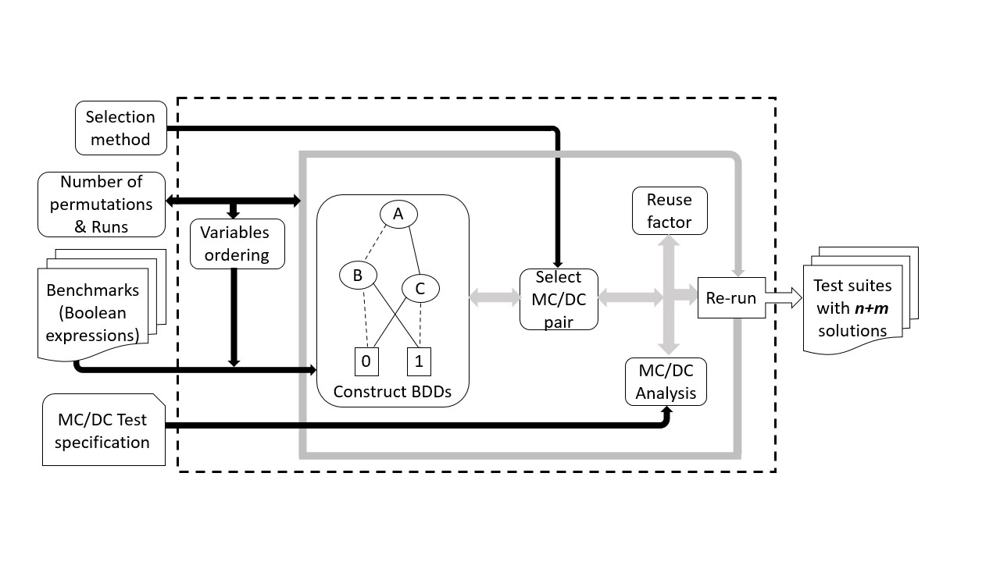
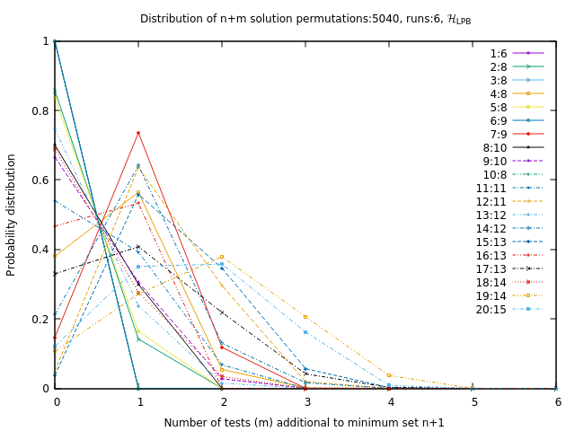

# py-mcdc
This project aims at generating test cases satisfying modified condition decision coverage (MC/DC) criterion based on reduced ordered decision diagrams (roBDDs).
We propose different heuristics for selection of test cases based on longest paths in the roBDDs and all of them maximize the reuse factor:
- longest paths and reuse factor as a natural number ()
- longest paths and reuse factor as a Boolean number ()
- longest paths which may merge and reuse factor as a natural number () 
- longest paths which may merge and reuse factor as a Boolean number () 
- longest paths with better size ()

 The following is our setup framework:



Our setup takes as input the roBDD for a given decision, the number of permutations, and the number of runs. 
That is every heuristic is applied for a number of permutations of the order of the conditions and we repeat a run on a given permutation,
exploring different random choices within the equivalent best pairs.
The selection method refers to the different heuristics proposed.
The benchmarks refer to the specifications written as Boolean expressions (decisions).
You can find the [TCAS II decisions](https://github.com/selabhvl/py-mcdc/blob/main/mcdc_test/tcasii.py).
MC/DC test specifications are the meaning of what is MC/DC in the context of roBDDs and three values logic.
We consider the reuse factor in our MC/DC analysis to reuse as much as possible the existing selected TCs.
Finally, we produce n MC/DC pairs as output for each decision with the size of n+m solutions.

## Dependencies
- python 3.8 (minimum)
- pyeda library
- Graphviz packages

## Installing Dependencies & Build
- Install the Python3 "development" package.

  For Debian-based systems (eg Ubuntu, Mint):

  `sudo apt-get install python3-dev`

  For RedHat-based systems (eg RHEL, Centos):

   `sudo yum install python3-devel`

- Install the dependencies:
   `pip3 install -r requirements.txt`

- Install the Graphviz packages (useful when you want to visualize roBDDs): 
    
    ```
    apt-get update
    apt-get install graphviz*
    ```
 
<!--
- Install latest release pyeda version using pip:

   `pip3 install pyeda`

- Install pyeda from the repository:
  
  Clone the pyeda library:

  `git clone git://github.com/cjdrake/pyeda.git`
-->

- Build
  ```
  python3 setup.py clean --all
  python3 setup.py build
  python3 setup.py install --force --user
  ```

## Generating BDDs 

- To generate a BDD for a Boolean expression
    ```
    # python3
    >>> from pyeda.inter import *
    >>> from graphviz import Source
    >>> a, b, c, d, e= map(bddvar, 'abcde')
    >>> f=a & (~b | ~c) & d | e
    >>> gv = Source(f.to_dot())
    >>> gv.render('Example1', view=True)
    ```
## Generating MC/DC test cases from an roBDD
- Clone this library:

  `git clone https://github.com/selabhvl/py-mcdc.git`

- Generate MC/DC test cases from the command line (for TCAS II specifications)

  `python3 mcdc_test/pathsearch.py "number of permutations" "number of runs"`

- Example for 5040 order permutations and 6 runs (It takes very long time for high number of permutations, You can use few number permutations to try it first (for example 5)):

  `python3 mcdc_test/pathsearch.py 5040 6`
- To generate curves with GNUplot:
```
gnuplot -p 'generated file.plot' 
```

- Example: 
```
gnuplot -p 'VS-LongestBool.11-5040-6.plot'
```
### Result:
The figure below show the probability distribution for n+m solutions using longest paths and reuse factor as a Boolean number ().
The labels indicate the decision number in the [TCAS II decisions](https://github.com/selabhvl/py-mcdc/blob/main/mcdc_test/tcasii.py) and the number of condition contained in that specific decisions.
For example 1:6 means the first decision and it contains 6 conditions. The closer the curves are to the top left the more the n+1 solutions.




      


